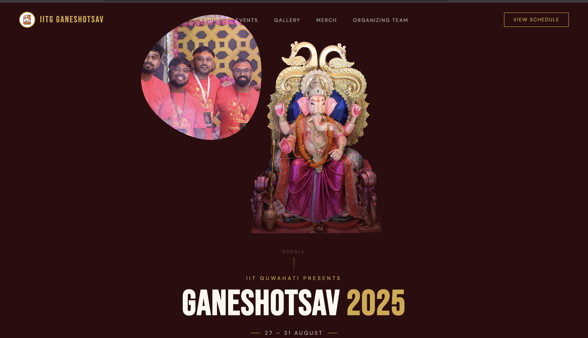
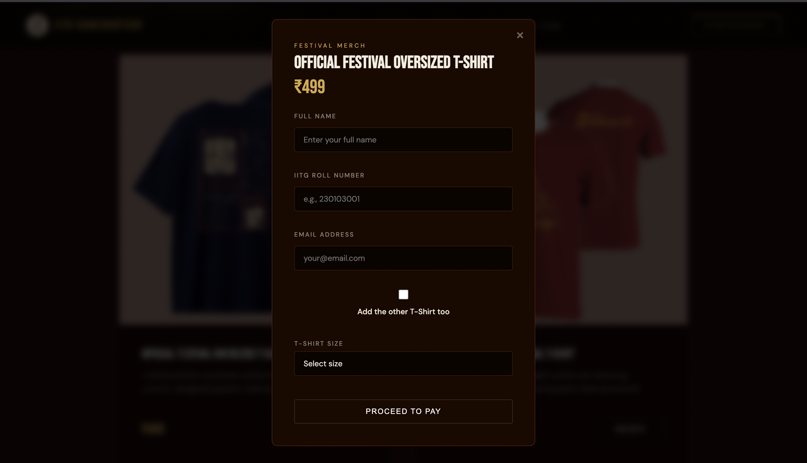

<div align="center">


# 🪔 IITG Ganeshotsav 2025

### Full-Stack Event Management Platform
#### IIT Guwahati's Annual Ganesh Festival — Built from scratch

[](https://nodejs.org)
[](https://expressjs.com)
[](https://mongodb.com)
[](https://javascript.com)
[](https://razorpay.com)
[](https://jwt.io)

[View Site](#) · [Admin Portal](#) · [Report Bug](https://github.com/tannyy25/IITG-Ganeshotsav-2025/issues)

</div>

---

## 📸 Preview

>

| Hero Section | Merch Order | Admin Dashboard |
|---|---|---|
|  |  |  |

---

## ✨ Features

### 🎨 Frontend
- **Fluid blob reveal effect** — Canvas API animation, group photo revealed as cursor moves (inspired by Lando Norris website)
- **Horizontal scroll gallery** — Pinned scroll section, images slide horizontally as user scrolls vertically
- **Custom animations** — Scroll-triggered fade-ups, speed lines, parallax hero
- **Merch order modal** — Size selection, combo option, smooth open/close animations
- **Fully responsive** — Mobile, tablet and desktop

### ⚙️ Backend
- **Razorpay payment gateway** — Full integration for merch orders and donations
- **Automated email receipts** — Nodemailer sends digital slip to donor/buyer instantly after payment
- **JWT authentication** — Protected admin routes, secure login system
- **MongoDB transactions** — All orders and donations stored with payment ID, status, timestamps
- **Rate limiting** — Express rate limiter to prevent API abuse
- **Input validation** — express-validator on all POST routes

### 📊 Admin Dashboard
- Live revenue stats — total, orders, donations
- Full transactions table with search and filter
- Pagination
- JWT-protected login

---

## 🛠 Tech Stack

| Layer | Technology |
|-------|-----------|
| Frontend | HTML5, CSS3, Vanilla JS, Canvas API |
| Backend | Node.js, Express.js |
| Database | MongoDB, Mongoose |
| Payments | Razorpay |
| Email | Nodemailer (Gmail SMTP) |
| Auth | JWT, bcryptjs |
| Security | express-rate-limit, express-validator |

---

## 🚀 Local Setup

### Prerequisites
- Node.js v18+
- MongoDB (local or Atlas)
- Gmail account with App Password

### Steps

**1. Clone the repo**
```bash
git clone https://github.com/tannyy25/IITG-Ganeshotsav-2025.git
cd IITG-Ganeshotsav-2025
```

**2. Install backend dependencies**
```bash
cd backend
npm install
```

**3. Create `.env` file in `/backend`**
```env
MONGO_URI=mongodb://127.0.0.1:27017/ganeshotsav
PORT=5001
JWT_SECRET=your_jwt_secret
SEED_KEY=your_seed_key
EMAIL_USER=yourgmail@gmail.com
EMAIL_PASS=your_16_char_app_password
```

**4. Start backend**
```bash
npm run dev
```

**5. Seed admin account (once only)**
```bash
POST http://localhost:5001/api/auth/seed
{
  "username": "admin",
  "password": "yourpassword",
  "seedKey": "your_seed_key"
}
```

**6. Open frontend**

Serve the root folder:
```bash
cd ..
npx serve .
```
Open `http://localhost:3000`

---

## 💳 Payment Flow

```
User fills form → Razorpay popup opens
       ↓
   User pays
       ↓
Payment ID returned → POST /api/transactions/create
       ↓
Transaction saved to MongoDB
       ↓
Email receipt sent to user
       ↓
Shows in Admin Dashboard
```

---

## 🔐 API Endpoints

| Method | Endpoint | Auth | Description |
|--------|----------|------|-------------|
| POST | `/api/auth/seed` | None | Create admin (once) |
| POST | `/api/auth/login` | None | Get JWT token |
| POST | `/api/transactions/create` | None | Save transaction + send email |
| GET | `/api/transactions` | JWT | All transactions |
| GET | `/api/transactions/stats` | JWT | Revenue stats |


<div align="center">

Made with 🧡 for Ganeshotsav IITG 2025

**Ganpati Bappa Morya! 🪔**

</div>
